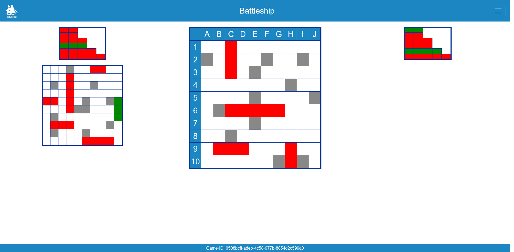

# Projekt: Battleship (Fr/2, Kr)

> Unser Projekt ist "Schiffe versenken". //TODO: Beschreibung



Keywords: Bootstrap, Server-Sent Events (SSE), Accessmanager, ctx.render(), Routes, Path

Projektbeteiligte:

* Jannik Lapp
* Max Stephan


<Inhaltsverzeichnis>
//TODO Inhaltsverzeichnis

# Server-Sent Events (SSE)

```Java
app.sse("/sse", client -> {
    //Daten Senden
    client.sendEvent("data");

    client.onClose( () -> { 
        //Handle Conection Closed 
    });
});
```
```js
//Client mit SSE verbinden
var eventSource = new EventSource("//" + location.hostname + ":" + location.port + "/sse"); 

//Antwort Listener
eventSource.addEventListener('message', e => {
    //Antwort verarbeiten
    console.log(e.data);
});
```

```Java
//Daten mit bestimmtem event Senden
client.sendEvent("event", "data");
```

```js
//Antwort Listener mit eigenem Event
eventSource.addEventListener('event', e => {
    //Antwort verarbeiten
    console.log(e.data);
});
```

```Java
//Daten mit bestimmtem event + id Senden
client.sendEvent("event", "data", "1");
```

```js
//TODO with id 
```

# Accessmanager

```Java
//AccesManager konfigurieren
app.accessManager((handler, ctx, permittedRoles) -> {
    MyRole userRole = getUserRole(ctx);
    if (permittedRoles.contains(userRole)) {
        handler.handle(ctx);
    } else {
        ctx.status(401).result("Unauthorized");
    }
});

Role getUserRole(Context ctx) {
    //Benutzer Role herausfinden und zurückgeben 
}

//Mögliche Rollen festlegen 
enum MyRole implements Role {
    ANYONE, ROLE_ONE, ROLE_TWO, ROLE_THREE;
}
```

> **Achtung**:  app.accesManager muss vor app.start() aufgerufen werden

```Java
app.get("/test", ctx -> { 
        //Normaler get code 
    }, Set<Role>);
    //das Set<Role> legt die erlaubten Rollen fest 
```

# ctx.render()

```Java
app.get("/page", ctx -> {
    //Some code
    ctx.render("path");
})
```

> **Achtung**: Das Rendern von Verchiedenen Datei typen benötigt meist andere dependencies, um herauszufinden welche kann man einfach den Code einmal aufrufen und in der Konsole wird einem dann die benötigte dependencie angezeigt und man kann sie zu build.gradle hinzufügen.

//TODO pfad erklären ab resources 

>**Achtung**: Beim Rendern von **Markdown** dateien muss der **Datei Pfad** mit einem **'/'** beginnen da dies intern mit //TODO genaue bezeichnung

```Java
//Datei bekommen 
ctx.render(path).resultString();
//ctx.render mit SSE
client.sendEvent("Key", client.ctx.render(path).resultString());
```

# Routes

```Java
app.routes(() -> {
    get("/get", ctx -> { /*Some Code*/ });
    post("/post", ctx -> { /*Some Code*/});
});
```
//TOD mit path usw. 

>**Achtung**: Damit man get usw. aufrufen kann muss man den APiBuilder importieren: 

`import static io.javalin.apibuilder.ApiBuilder.*;`

# Path

//TODO 

//vtl. noch ein ctx.Header, ctx.sessionAttribute("Name", ctx.queryParam("Name")), Javalin Exeptions, vtl. noch igenwas von js;